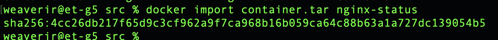

## Part 1. Готовый докер

В качестве конечной цели своей небольшой практики ты сразу выбрал написание докер-образа для собственного веб-сервера, а потому в начале тебе нужно разобраться с уже готовым докер-образом для сервера.
Твой выбор пал на довольно простой **nginx**.

**== Задание ==**

1) Возьми официальный докер-образ с **nginx** и выкачай его при помощи `docker pull nginx`.
2) Проверь наличие докер-образа через `docker images`.
3) Запусти докер-образ через `docker run -d nginx`.
4) Проверь, что образ запустился через `docker ps`.
   


5) Посмотри информацию о контейнере через `docker inspect [container_id|container_name]` `docker inspect reverent_cori`.
   


6) По выводу команды определи и помести в отчёт размер контейнера, список замапленных портов и ip контейнера.

Размер контейнера `docker ps -s` `1.09kB (virtual 192MB)`

Порты не замаплены `("PortBindings": {})`.

Экспонированный порт: 80/tcp (но не замаплен на хост).

IP контейнера: `172.17.0.2`

7) Останови докер контейнер через `docker stop [container_id|container_name]`.
8) Проверь, что контейнер остановился через `docker ps`.


9) Запусти докер с портами 80 и 443 в контейнере, замапленными на такие же порты на локальной машине, через команду *run* `docker run -d -p 80:80 -p 443:443 nginx`.


10) Проверь, что в браузере по адресу *localhost:80* доступна стартовая страница **nginx**.


11) Перезапусти докер контейнер через `docker restart [container_id|container_name]`. `docker ps`(CONTAINER ID = 4eff495e45f4) -> `docker restart 4eff495e45f4`.
12) Проверь любым способом, что контейнер запустился. `docker ps`


## Part 2. Операции с контейнером

Докер-образ и контейнер готовы. Теперь можно покопаться в конфигурации **nginx** и отобразить статус страницы.

**== Задание ==**

#####1) Прочитай конфигурационный файл *nginx.conf* внутри докер контейнера через команду *exec*. `docker exec -it [container_id] cat /etc/nginx/nginx.conf` -> `docker exec -it 4eff495e45f4 cat /etc/nginx/nginx.conf`


##### 2) Создай на локальной машине файл *nginx.conf*.
##### 3) Настрой в нем по пути */status* отдачу страницы статуса сервера **nginx**.

```

user  nginx;
worker_processes  1;

events {
    worker_connections  1024;
}

http {
    include       /etc/nginx/mime.types;
    default_type  application/octet-stream;

    sendfile        on;
    keepalive_timeout  65;

    server {
        listen       80;
        server_name  localhost;

        location / {
            root   /usr/share/nginx/html;
            index  index.html index.htm;
        }

        # Настройка отдачи страницы статуса
        location /status {
            stub_status on;
      allow all;
            access_log off;
        }

        error_page  500 502 503 504 /50x.html;
        location = /50x.html {
            root   /usr/share/nginx/html;
        }
    }
}

```


##### 4) Скопируй созданный файл *nginx.conf* внутрь докер-образа через команду `docker cp`, `docker cp nginx.conf 4eff495e45f4:/etc/nginx/nginx.conf`.


##### 5) Перезапусти **nginx** внутри докер-образа через команду *exec*. `docker exec -it 4eff495e45f4 nginx -s reload`


##### 6) Проверь, что по адресу *localhost:80/status* отдается страничка со статусом сервера **nginx**.


##### 7) Экспортируй контейнер в файл *container.tar* через команду *export*. `docker export 4eff495e45f4 -o container.tar`
##### 8) Останови контейнер. `docker stop 4eff495e45f4`


##### 9) Удали образ через `docker rmi [image_id|repository]`, не удаляя перед этим контейнеры. `docker rmi -f nginx`


##### 10) Удали остановленный контейнер. `docker rm 4eff495e45f4`


##### 11) Импортируй контейнер обратно через команду *import*. `docker import container.tar nginx-status`



##### 12) Запусти импортированный контейнер. `docker run -d -p 80:80 nginx-status nginx -g 'daemon off;'`


##### 13) Проверь, что по адресу *localhost:80/status* отдается страничка со статусом сервера **nginx**.


## Part 3. Мини веб-сервер

Теперь стоит немного оторваться от докера, чтобы подготовиться к последнему этапу. Время написать свой сервер.

**== Задание ==**

##### Напиши мини-сервер на **C** и **FastCgi**, который будет возвращать простейшую страничку с надписью `Hello World!`.

```c
#include <fcgi_stdio.h>
#include <stdlib.h>

int main() {
    while (FCGI_Accept() >= 0) {
        printf("Content-type: text/html\r\n\r\n");
        printf("<html>\n");
        printf("<head><title>Hello World!</title></head>\n");
        printf("<body>\n");
        printf("<h1>Hello World!</h1>\n");
        printf("</body>\n");
        printf("</html>\n");
    }
    return 0;
}

```


##### Запусти написанный мини-сервер через *spawn-fcgi* на порту 8080.

##### Напиши свой *nginx.conf*, который будет проксировать все запросы с 81 порта на *127.0.0.1:8080*.

Подготавливаем main.c

```c
#include <fcgi_stdio.h>
#include <stdlib.h>

int main() {
    while (FCGI_Accept() >= 0) {
        printf("Content-type: text/html\r\n\r\n");
        printf("<html>\n");
        printf("<head><title>Hello World!</title></head>\n");
        printf("<body>\n");
        printf("<h1>Hello World!</h1>\n");
        printf("</body>\n");
        printf("</html>\n");
    }
    return 0;
}
```

Подготавливаем nginx.conf

```
worker_processes  1;

events {
    worker_connections  1024;
}

http {
    include mime.types;
    default_type application/octet-stream;

    sendfile on;

    keepalive_timeout 65;

    server {
        listen 81;
        server_name localhost;

        location / {
            fastcgi_pass 127.0.0.1:8080;
            include fastcgi_params;        # чтобы передать параметры FastCGI
        }
    }
}
```

Создаем конейнер с поддержкой 80 and 81 `docker run -d -p 81:81 nginx`

Копируем main.c && nginx.conf в контейнер

```
docker cp nginx/nginx.conf d7b87009536d:/etc/nginx
docker cp main.c d7b87009536d:/home
```

Запускаем докер пространство bash `docker exec -it busy_vaughan bash`

Устанавливаем пакеты

```
apt-get update
apt-get install -y libfcgi-dev spawn-fcgi gcc nginx lsof
```


Compile

```
cd /home
gcc -o mini_server main.c -lfcgi
```

Start

`spawn-fcgi -p 8080 ./mini_server`


Перезапускаем nginx `nginx -s reload`


##### Проверь, что в браузере по *localhost:81* отдается написанная тобой страничка.


При этом основная стр также работает *localhost:80*


Если ошибка в nginx.conf or main.c то нужно убить процесс `spawn-fcgi` -> `lsof -i :8080` -> `kill [id PID]`


##### Положи файл *nginx.conf* по пути *./nginx/nginx.conf* (это понадобится позже).

## Part 4. Свой докер

Теперь всё готово. Можно приступать к написанию докер-образа для созданного сервера.

**== Задание ==**

*При написании докер-образа избегай множественных вызовов команд RUN*

#### Напиши свой докер-образ, который:
##### 1) собирает исходники мини сервера на FastCgi из [Части 3](#part-3-мини-веб-сервер);
##### 2) запускает его на 8080 порту;
##### 3) копирует внутрь образа написанный *./nginx/nginx.conf*;
##### 4) запускает **nginx**.
_**nginx** можно установить внутрь докера самостоятельно, а можно воспользоваться готовым образом с **nginx**'ом, как базовым._


Dockerfile

```Dockerfile
FROM nginx

COPY ./nginx/nginx.conf /etc/nginx/nginx.conf
COPY ./main.c /home/main.c
COPY ./run.sh /home/run.sh
RUN apt update && apt install -y gcc spawn-fcgi libfcgi-dev lsof
WORKDIR /home/
ENTRYPOINT ["sh", "/home/run.sh"]
```

sh скрипт

```
#!/bin/bash

gcc -o server main.c -lfcgi
spawn-fcgi -p 8080 ./server
nginx -g "daemon off;"
```

##### Собери написанный докер-образ через `docker build` при этом указав имя и тег. `docker build -t my_server:latest .`
##### Проверь через `docker images`, что все собралось корректно.
##### Запусти собранный докер-образ с маппингом 81 порта на 80 на локальной машине и маппингом папки *./nginx* внутрь контейнера по адресу, где лежат конфигурационные файлы **nginx**'а (см. [Часть 2](#part-2-операции-с-контейнером)).

`docker run -it --name serv -d -p 80:81 -v $(pwd)/nginx/nginx.conf:/etc/nginx/nginx.conf my_server:latest bash`


##### Проверь, что по localhost:80 доступна страничка написанного мини сервера.


##### Допиши в *./nginx/nginx.conf* проксирование странички */status*, по которой надо отдавать статус сервера **nginx**.

```
pid        /var/run/nginx.pid;


events {
    worker_connections  1024;
}


http {
    server{
        listen 81;
        location / {
            fastcgi_pass 127.0.0.1:8080;
        }

        location /status{
            stub_status on;
        }
    }
    include       /etc/nginx/mime.types;
    default_type  application/octet-stream;

    sendfile        on;

    keepalive_timeout  65;


}
```

##### Перезапусти докер-образ. `docker restart serv`

Перезапустим nginx в своем докер образе командой `nginx -s reload`

*Если всё сделано верно, то, после сохранения файла и перезапуска контейнера, конфигурационный файл внутри докер-образа должен обновиться самостоятельно без лишних действий*.
##### Проверь, что теперь по *localhost:80/status* отдается страничка со статусом **nginx**


## Part 5. **Dockle**

После написания образа никогда не будет лишним проверить его на безопасность.

**== Задание ==**

Устанавливаем dockle `brew install goodwithtech/r/dockle`

##### Просканируй образ из предыдущего задания через `dockle [image_id|repository]`.

Так как у нас конетейнер расположен локально 

Сохраняем docker image `docker save -o serv.tar my_server:latest`

Затем `dockle --input serv.tar`

Выходит ошибка


##### Исправь образ так, чтобы при проверке через **dockle** не было ошибок и предупреждений.

Добавляем в Dockerfile пользователя nginx для повышения безопасности

```Dockerfile
USER nginx
```

Для решения ошибки CIS-DI-0005: Enable Content trust for Docker

в терминал вводим `export DOCKER_CONTENT_TRUST=1`

Для последующих исправлений меняем Dockerfile

```Dockerfile
FROM nginx
WORKDIR /home/

COPY ./nginx/nginx.conf /etc/nginx/nginx.conf
COPY ./main.c /home/main.c
COPY ./run.sh /home/run.sh

USER root

RUN apt update && apt install -y gcc spawn-fcgi libfcgi-dev lsof; \
    chown -R nginx:nginx /var/cache/nginx; \
    chown -R nginx:nginx /home; \
    touch /var/run/nginx.pid; \
    chown -R nginx:nginx /var/run/nginx.pid; \
    rm -rf /var/lib/apt/lists

# Безопасные права для конкрет файлов CIS-DI-0008
RUN chmod u-s /usr/bin/passwd && \
    chmod u-s /usr/bin/chfn && \
    chmod u-s /usr/bin/chsh && \
    chmod u-s /usr/bin/su && \
    chmod u-s /usr/bin/gpasswd && \
    chmod u-s /usr/bin/newgrp && \
    chmod u-s /usr/bin/mount && \
    chmod u-s /usr/bin/umount

USER nginx

ENTRYPOINT ["sh", "/home/run.sh"]

# Проверка жив ли контейнер CIS-DI-0006
HEALTHCHECK --interval=30s --timeout=10s --retries=3 CMD curl -f http://localhost || exit 1
```

Для решения CIS-DI-0010: Do not store credential in environment variables/files

Есть 2 способа

1) Игнорируем ошибку связанную с переменными окружения

`dockle -i CIS-DI-0010 --input serv.tar`

2) Добавляем переменные окружения - на шк маке не работает

`dockle -ak NGINX_GPGKEY -ak NGINX_GPGKEY_PATH --input serv.tar`

```bash
#!/bin/bash

docker build -t my_server:latest .
export DOCKER_CONTENT_TRUST=1
docker save -o serv.tar my_server:latest
dockle -i CIS-DI-0010 --input serv.tar
```


## Part 6. Базовый **Docker Compose**

Вот ты и закончил свою разминку. А хотя погоди...
Почему бы не поэкспериментировать с развёртыванием проекта, состоящего сразу из нескольких докер-образов?

**== Задание ==**

##### Напиши файл *docker-compose.yml*, с помощью которого:
##### 1) Подними докер-контейнер из [Части 5](#part-5-инструмент-dockle) _(он должен работать в локальной сети, т. е. не нужно использовать инструкцию **EXPOSE** и мапить порты на локальную машину)_.
##### 2) Подними докер-контейнер с **nginx**, который будет проксировать все запросы с 8080 порта на 81 порт первого контейнера.
##### Замапь 8080 порт второго контейнера на 80 порт локальной машины.

##### Останови все запущенные контейнеры.
##### Собери и запусти проект с помощью команд `docker-compose build` и `docker-compose up`.
##### Проверь, что в браузере по *localhost:80* отдается написанная тобой страничка, как и ранее.

```Docker-Compose.yml
services:
  server:
    build: ../part5
  proxy:
    build: .
    ports:
      - 80:8080
```

```run.sh
#!/bin/bash

nginx -g "daemon off;"

chmod +x run.sh
```

```nginx
pid        /var/run/nginx.pid;

events {
    worker_connections  1024;
}


http {
    server{
        listen 8080;
        location / {
            proxy_pass http://server:81/;
        }

        location /proxy {
            stub_status on;
        }
    }
    include       /etc/nginx/mime.types;
    default_type  application/octet-stream;

    sendfile        on;

    keepalive_timeout  65;


}
```


Останавливаем все запущенные контейнеры `docker-compose down`

Собираем и запускаем проект

```
docker-compose build
docker-compose up
```

errors

```
[emerg] 7#7: mkdir() "/var/cache/nginx/client_temp" failed (13: Permission denied)
nginx: [emerg] mkdir() "/var/cache/nginx/client_temp" failed (13: Permission denied)
chmod: changing permissions of 'run.sh': Operation not permitted

[emerg] 14#14: open() "/var/run/nginx.pid" failed (13: Permission denied)
nginx: [emerg] open() "/var/run/nginx.pid" failed (13: Permission denied)
chmod: changing permissions of 'run.sh': Operation not permitted

/usr/bin/ld: cannot open output file server: Permission denied
collect2: error: ld returned 1 exit status
spawn-fcgi: child exited with: 2
```


Для решения ошибок добавил к RUN apt

```
    chown -R nginx:nginx /var/cache/nginx; \
    chown -R nginx:nginx /home; \
    touch /var/run/nginx.pid; \
    chown -R nginx:nginx /var/run/nginx.pid; \
```

```Dockerfile
FROM nginx
WORKDIR /home/

COPY ./nginx/nginx.conf /etc/nginx/nginx.conf
# COPY ./main.c /home/main.c # В Part5 присутствует
COPY ./run.sh /home/run.sh

USER root

RUN apt update && apt install -y gcc spawn-fcgi libfcgi-dev lsof; \
    chown -R nginx:nginx /var/cache/nginx; \
    chown -R nginx:nginx /home; \
    touch /var/run/nginx.pid; \
    chown -R nginx:nginx /var/run/nginx.pid; \
    rm -rf /var/lib/apt/lists

# Безопасные права для конкрет файловCIS-DI-0008
RUN chmod u-s /usr/bin/passwd && \
    chmod u-s /usr/bin/chfn && \
    chmod u-s /usr/bin/chsh && \
    chmod u-s /usr/bin/su && \
    chmod u-s /usr/bin/gpasswd && \
    chmod u-s /usr/bin/newgrp && \
    chmod u-s /usr/bin/mount && \
    chmod g-s /usr/bin/expiry && \
    chmod g-s /usr/sbin/unix_chkpwd && \
    chmod g-s /usr/bin/chage && \
    chmod u-s /usr/bin/umount

USER nginx

ENTRYPOINT ["sh", "/home/run.sh"]

# Проверка жив ли контейнер CIS-DI-0006
HEALTHCHECK --interval=30s --timeout=10s --retries=3 CMD curl -f http://localhost || exit 1
```


Результат


